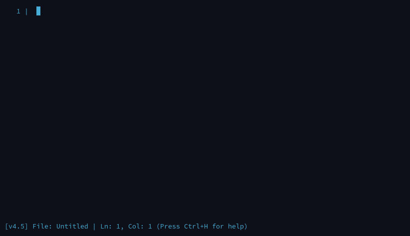

# ced 
**Custom terminal based text editor written in C89, ncurses and UNIX headers.**

## Features
- Syntax highlighting.
- Undo/Redo.
- Status bar.
- Under 40KB (~37KB).
- Designed to be compliant with UNIX/POSIX operating systems.
- Single file.
- Shell panel.

## Prerequisites
- Use UNIX/POSIX based OS. (e.g. Linux)
- Use GCC or any other C compiler.
- Have ncurses installed.

## How to use

### Build it
```bash
gcc -o ced main.c -lncurses
```

### Run it
```bash
./ced
```

## Screenshots


**your terminal might look different, I use xcfe4 terminal**

## Key Bindings

- Ctrl+H: Hide/Show the keybindings.
- Ctrl+Q: Quit
- Ctrl+S: Save
- Ctrl+O: Open
- Ctrl+Z: Undo
- Ctrl+Y: Redo
- Ctrl+G: Goto Line
- Ctrl+F: Search
- Ctrl+R: Replace (prompts the old text and new text, then does a naive replace all in every line)
- Ctrl+W: Shell panel toggle
- Ctrl+E: Enter shell command
- Ctrl+D: Duplicate current line
- Ctrl+K: Kill (delete) current line
- Ctrl+T: Toggle line numbers on/off
- Ctrl+U: Jump to top of file
- Ctrl+L: Jump to bottom of file
- Home/End, PgUp/PgDn: Navigation
- Mouse: Click to move cursor, wheel scroll

## See [Contributing](https://github.com/Zank613/ced/blob/master/CONTRIBUTING.md) for contribution.

## Acknowledgements
- **[ncurses](https://invisible-island.net/ncurses/)**

## License
### ced is licensed under MIT License. Check [LICENSE](https://github.com/Zank613/ced/blob/master/LICENSE) for more.

## Notes
### Syntax highlighting
- Even though this uses a similar *highlight.syntax* file from my previous [text editor](https://github.com/Zank613/simple_editor) they use a slightly different parser and the file itself is altered for better syntax highlighting.

### [Previous editor](https://github.com/Zank613/simple_editor)
- This editor is very similar to the previous editor, this just only a true single file and made in C89.